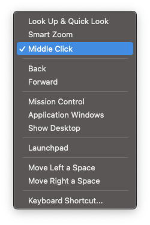

Logitech's MX Master line of productivity mice has been the _defacto_ choice for a lot professionals whose job heavily relies on a versatility when interacting with a computer, but are they using it to its full potential?

## Introduction

I confess I have never cared much for computer mice for my job. I did at one point care a lot about gaming mice at the peak of my Counter-Strike days, and I had all sorts of trypophobia inducing, hole-filled ultra-lightweight gaming mice from experimental Chinese companies.

For non-gaming occasions I always felt that the fantastic MacBook trackpad sufficed, and it did. I've always used my MacBook as my keyboard + mouse combo, even at my desk setup at home, where I used to place my MacBook under my big monitor to have it centrally placed.

That changed.

At Cloudflare, I'm part of a team of seven Solutions Engineers. Out of my six colleagues, five use a Logitech MX Master 3S. I often noticed this but didn't really understand the point of carrying around a heavy, big, somewhat clunky-looking mouse to work when all of us had access to a perfectly engineered trackpad.

## The _itch_

We moved to the new beautiful Lisbon office some months ago and all desks have a default keyboard/mouse combo. I naturally started to use the provided peripherals and after a while started to feel the benefits of having dedicated peripherals. Moving the MacBook to the side felt much more comfortable than having two screens stacked vertically.

The mice we have at the office are basic Logitech mice with no extra buttons apart from mouse 1, mouse 2, and scroll wheel. I use Spaces on MacOS a lot, as well as full screen applications so using the horizontal three-finger swipe comes natural to me. I wanted to find a way to replicate this action simply using my mouse. I thought this couldn't be done easily with a normal mouse.

_Before continuing, this post will do a favor to the world and ignore that the Apple Magic Mouse is a thing._

## Finding the correct app

I promptly searched for third-party applications that could assist me in making the most out of an external mouse. A few quick Google searches and reddit reads led me to the following:

- [_MacMouseFix_](https://mousefix.org/)
- [_Mos_](https://mos.caldis.me/)
- [_Better Mouse_](https://better-mouse.com/)

I won't go too much into detail on every single one of them but _Mos_ was quickly discarded as I didn't see much movement in the way of app updates. _Better Mouse_ looks incredible, but it's paid and I just wanted something to be put quickly in place. _MacMouseFix_ seems to be the most popular app and it naturally was the one I tried first. It did the trick.

### Getting the "three-finger swipe" back

_MacMouseFix_ offers multiple ways to improve the way you use your external mouse with MacOS. I was mostly focused on finding an easy way to swipe across my spaces easily, so let's cover that first.

_MacMouseFix_'s UI is very simple to use. When clicking on the __'Buttons'__ tab we get access to a menu that allows to map different functions or actions to different mouse buttons.

As I tried this out with my the basic Logitech mouse first, the only button I could map to something else was the scroll wheel down press, also known as the middle button.

You map a button to something by hovering the cursor over the area marked with a __+__ and by pressing it.

Then, the button will show up in the list below, ready to be mapped to different functions:

I decided to set the "Click and Drag" action to _Spaces and Mission Control_.

It was an immediate success.

I could finally swipe across my spaces with my mouse by simply pressing a button while dragging the mouse to the side. It works brilliantly, and it immediately solved the problem I was trying to fix. Then, I decided to explore the rest.

## The need for more buttons

A lot can be done when personalizing the behavior of your mouse with an application like this and I quickly thought of multiple quick productivity wins I could get, but there was a problem. I ran out of buttons.

A quick glance to the side I and I remembered that pretty much my whole team uses a Logitech MX Master 3S. Upon a quick Google search, I found it had, at least, 5 addressable buttons that could be used. Just imagine the possibilities. The order was placed.

I am now the proud owner of an MX Master 3S, and I have been so for the past three weeks. I'm very happy with my purchase. and I've already reached a level of customization that I am happy with, but there's still a lot do to.

This is my current _Mac Mouse Fix_ configuration:

You will be able to see it's not ideal and that there are some duplicate actions (I still haven't found a good use for the bottom membrane button of this mouse), but most of the functions present there are used by me on a daily basis, and are fully ingrained in my muscle memory.

Actions like _Smart Zoom_ when I hold Mouse 5 are great for I am sharing my screen and want to place emphasis on something on screen. A simple tap of the same button executes a _Cmd +_ which defaults to _Zoom In_ on most apps. A simple of tap of Mouse 4 does the opposite.

I take a lot of screenshots. It's a big part of my day-to-day workflow and it always required me to use a keyboard shortcut to quickly take a screenshot of something on screen. Now, I can screenshot a selection (hold Mouse 4) and paste that screenshot somewhere (Double Click Mouse 5), all whilst never touching the keyboard. How cool is that?

## Giving back

I thoroughly assumed that most of my colleagues were fully aware of all of these apps, or that they at least used the _bloatwarey_ Logitech software to make the most out of their fantastic peripheral. I was wrong.

They barely used the extra buttons on the MX, most of them mainly used it for it's horizontal scroll wheel. This sparked a need to share how I used the mouse with them and convince them of all the amazing things they can do with a simple piece of software and hardware they already own.

I think it worked.
